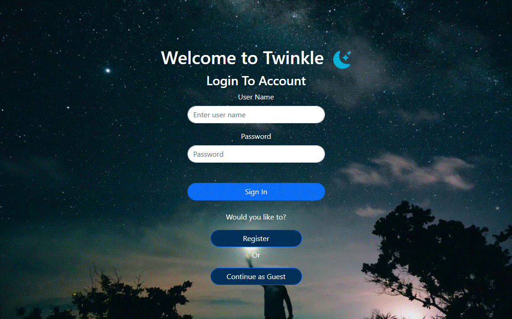
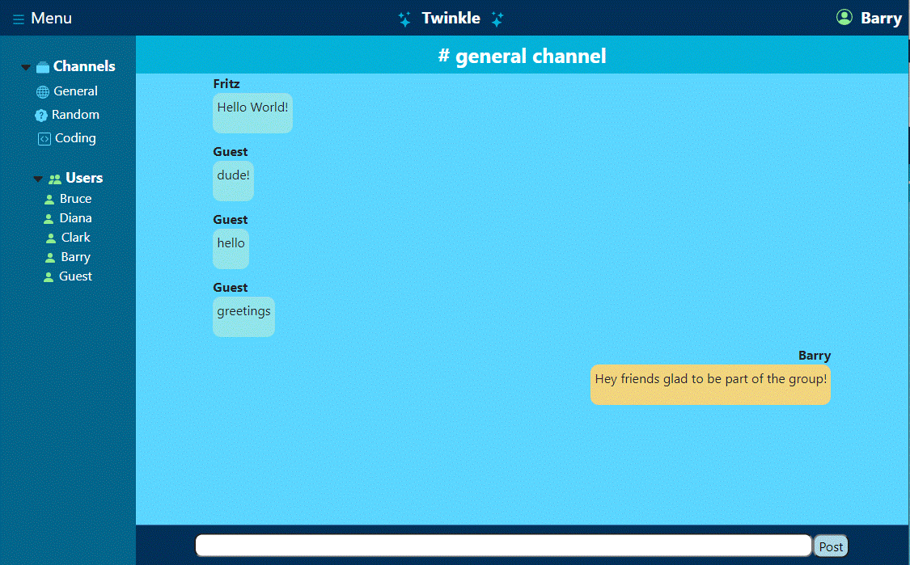
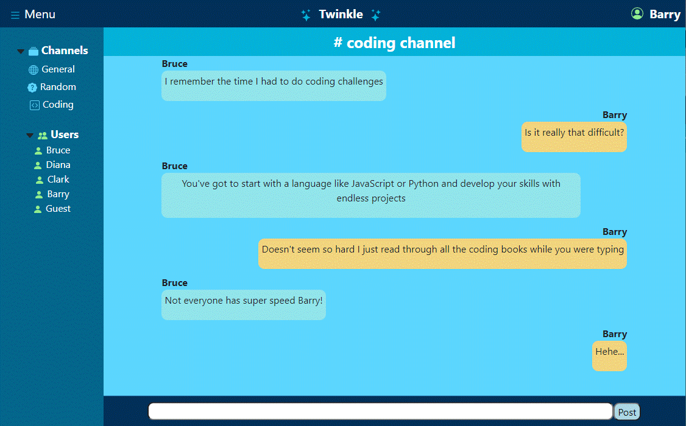
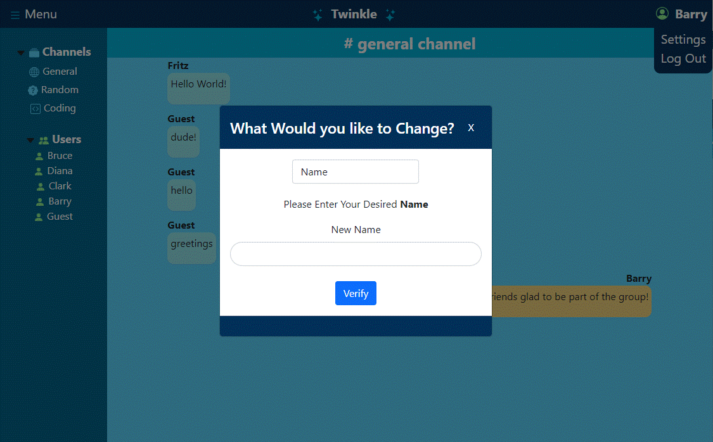
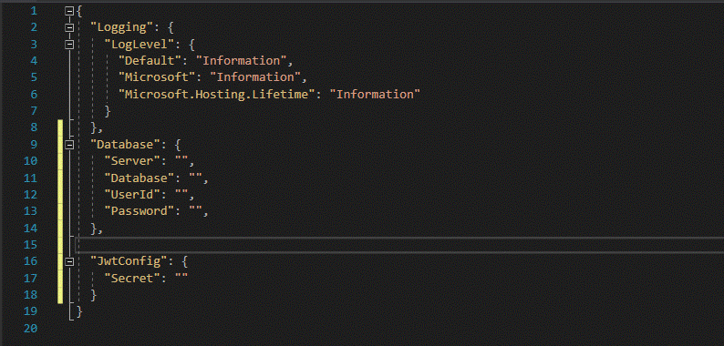

## Welcome to Twinkle!

A full-stack chat-app deployed to Azure and created using React, .Net 5, Boostraps, PostgreSQL, Nhibernate, Axios and SignalR.

Try it out [here](https://twinkle-chat.azurewebsites.net/)

## Navigation

Login Page:

- Sign in to your existing account with your name and password
- Register to create an account using a name and password with a maximum of 10 letters
- Continue as Guest to sign in with a guest account

Chat Room:

- Header :
	- Menu: click to toggle with the channel navigational side bar
	- User Name: click to change user credentials or log out of the system.
- Side Bar: 
	- Channels: check out the different channels and converstations in them
	- Users: check out whos online with you

Chat Screen:

- Message Screen: see `Real-Time` messages from the channel

- Input: post a message with up to 200 characters to the channel

## Summary

I wanted to develop this application because it would continue my growth towards becoming a `Full Stack Developer`. Twinkle-chat is a full-stack application that uses `React`, `Bootstraps`, and `Axios` in the `front-end` to pass data and user information to the server.
The server uses `.Net 5` controllers, `SignalR` hubs, and `Nhibernate` mappings to transmit data smoothly to the database. `PostgreSQL` is the database used for this application and runs in `ElephantSQL` as a service during production. Twinkle is hosted and deployed in
`Azure` service using `GitHub` as the main pipeline for building and deploying. The project is set up with a clean `layered architecture` and tested with `NUnit Testing`.

This project was like climbing a mountain, everytime I had to learn something new I was toppled down by a new obstacle. I learned to be persistent and patient along the way. I had to allow time for information to sink in and which helped me understand every aspect of the application. Thanks to the Development Mastermind Group
I was able to overcome some of my greatest trails yet. 

## Instructions

In order to run this application on your local machine, follow these steps in order :

1 - Clone repo to local machine

2 - cd into `Chat-App` from where directory is saved

3 - cd into `API` directory then cd `client` and run `npm i`

4 - create `appsettings.development.json` file, populate with any JWT secret and database values
 

4 - then `cd ..` and run `dotnet watch run`

5 - Navigate to `localhost:5000` in your browser

## Author

---

- **Fritz Solibio** - _Software Development Mastermind Student_
